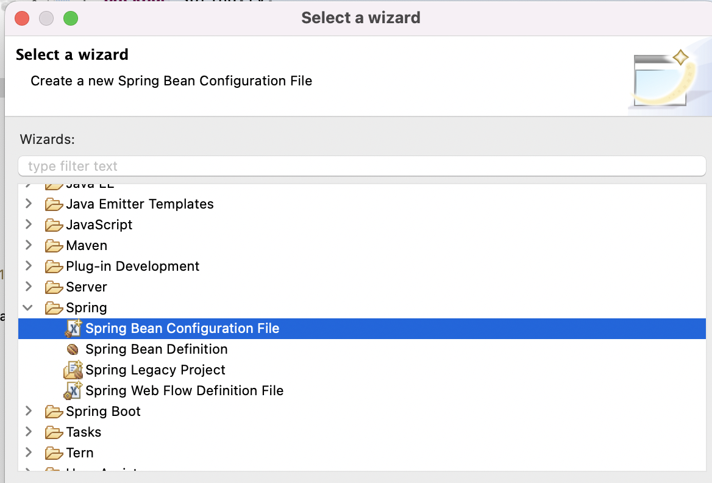

## :bulb: 프레임워크란?

**기능을 미리 만들어 제공하는 반제품** = 개발 생산성과 품질 보장

> 어느 정도 완성된 상태의 라이브러리 제공 = 사용자마다 동일, 라이브러리에 포함된 기능은 사용자가 구현할 필요가 없음.
>
> > 프레임워크 규칙을 지키면서 사용해야 한다.


## :mag_right: Spring 프레임워크

**경량 프레임워크로 애플리케이션에서 사용되는 여러가지 빈(클래스 객체)을 스프링이 권한을 가지고 직접 관리**

- 스프링 특징

  - 경량 컨테이너의 기능 수행

  - 제어 역행(IoC) 기술을 이용해 결합을 제어

  - 의존성 주입(DI) 기능 지원

  - 관점 지향(AOP) 기능을 이용해 자원 관리

  - 영속성과 관련된 다양한 서비스 지원

  - 라이브러리와의 연동 기능 지원

    

    


- xml `<bean>` 태그에 사용되는 여러가지 속성

| 속성 이름       | 설명                                                   |
| --------------- | ------------------------------------------------------ |
| id              | 빈 객체의 고유 이름으로, 빈 id를 이용해 빈에 접근한다. |
| name            | 객체의 별칭                                            |
| class           | 생성할 클래스, 패키지 이름까지 입력                    |
| constructor-arg | 생성자를 이용해 값을 주입할 때 사용                    |
| property        | setter를 이용해 값을 주입할 때 사용                    |

- `proeprty` 사용

```xml
<bean id="dto" class="member.MemberDTO">
<property name="id" value="jsp"/>
<property name="password" value="2222"/>
</bean>
```

- `proeprty` 사용 - 외부 전달값 존재할 경우

```xml
<bean id="dao" class="member.MemberDAO">
	<property name="dto" ref="dto1"/>
</bean>
```

> dto1값을 dto의 외부값으로 전달

- `constructor-arg` 사용 

```xml
<bean id="dto1" class="member.MemberDTO">
<constructor-arg name="id" value="servlet"/>
<constructor-arg name="password" value="2222"/>
</bean>
```

