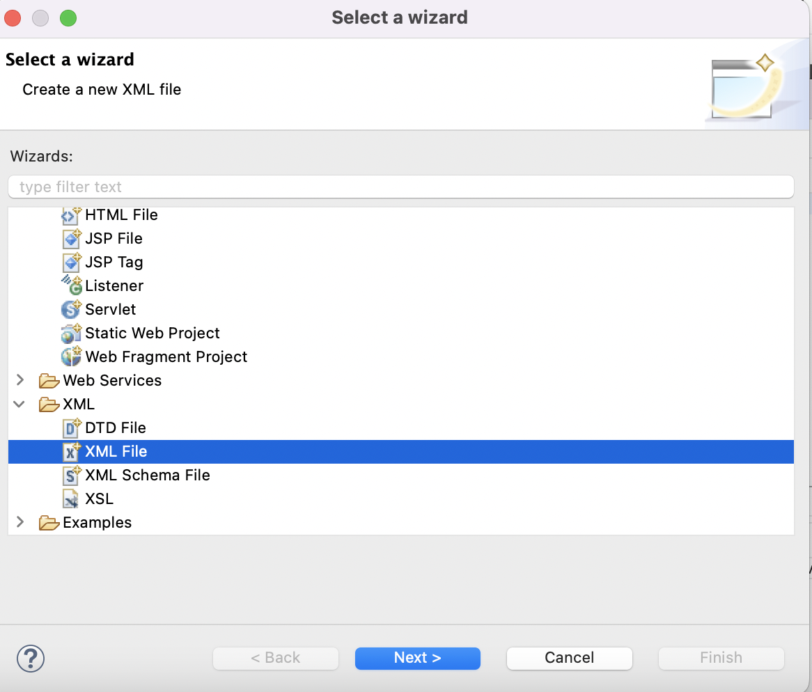

## :bulb: Mybatis 시작

1. mybatis 사용을 위해 `pom.xml`에 maven 추가 

```xml
<dependency>
		    <groupId>org.mybatis</groupId>
		    <artifactId>mybatis</artifactId>
		    <version>3.5.6</version>
		</dependency>
```


2. sql xml 파일 - sql mapping 파일 작성 
3. db config xml 파일 - db 연결 정보 (mybatis DataSource 사용 설정 )


- spring xml 파일이 아닌 그냥 xml 파일 생성 `mybatis-config.xml`



- `mybatis-config.xml`에 연결할 db 설정

```xml
<configuration>
	<environments default="mydb">
		<environment id="mydb">
			<transactionManager type="JDBC"/>
				<dataSource type="POOLED">		
					<property name="driver" value="com.mysql.cj.jdbc.Driver"/>		
					<property name="url" value="jdbc:mysql://127.0.0.1:3306/memberdb"/>	
					<property name="username" value="emp2"/>
					<property name="password" value="emp2"/>		
				</dataSource>
		</environment>
	</environments>
</configuration>
```

> ​	`<environments default=""> ` 사용할 db가 여러 개일 때 기본으로 사용할 db 설정 - db가 하나여도 필수 작성 
>
> > `<environment>` 하나가 db 하나, db를 추가할 땐 `<environment>` 태그를 추가하여 작성 


- `mybatis-config.xml`에 sql를 정의하는 파일 mapping

```xml
<!-- sql 정의 파일명 위치   -->
	<mapper namespace="member">>
	<!-- mapper 복수 정의 가능. 파일이 여러개면 여러개 정의  -->
		<mapper resource="mybatis/sql-mapping.xml"/>
   <!-- 테이블 단위로 만드는게 좋음 ex)board에 관한건 board-mapping.xml -->
	</mappers>
```

> mapper의 namespace는 필수 항목
>
> > 자바에서 불러올 때 namespace.id로 호출 => member.membercount
> >
> > ```java
> > session.selectOne("member.membercount");

- sql를 정의하는 파일 생성, 구현 mybatis 패키지 안에 `sql-mapping.xml`
  - selectList = 결과가 여러개일때 arraylist 형태로 가져옴
  - selectOne, select = 결과가 한 개 일 때
  - selectMap= map 형태로 가져옴 


- sql xml 파일 : CRUD
  - < select id ="" resultType="" ( parameterType="") >
  - < insert id ="" >
  - < update id ="" >
  - < delete id ="" >

> 모든 CRUD 기능엔 id 속성은 필수, parameterType은 선택 
>
> > 그 중 select 기능엔 resultTYpe 속성 필수


## :mag_right: Mybatis - CRUD 반영

- insert / delete / update(DML) 은 임시 버퍼에 저장된다.
- commit / rollback을 이용해 db에 값을 저장할지, 삭제할지 선택한다.
  - 메소드 안에 개별 commit 설정 : `session.commit()`
  - session 설정 시 자동 commit 설정 : `SqlSession session = factory.openSession(true);`
  - select는 db에 영향을 주는 기능이 아니기 때문에 commit / rollback을 지정하지 않아도 된다.


## :mag_right: typeAlias

`mybatis-config.xml` 의 < configuration > 태그 안에 `typeAliases`로 별칭 설정 

```xml
<typeAliases>
	<typeAlias type="mybatis2.MemberDTO" alias="memberdto"/>
</typeAliases>
```

> mybatis2 패키지 안에 MemberDTO의 별칭을 memberdto로 설정

- 원래 코드

```xml
<insert id=*"insertmember"* parameterType=*"mybatis2.MemberDTO">
```

- Alias 설정 후

```xml
<insert id=*"insertmember"* parameterType=*"memberdto">
```

