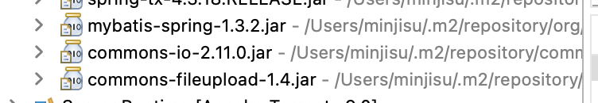

## :bulb: 다중 파일 업로드하기

웹 클라이언트가 요청을 보낼 때, **http** 

- 파일 업로드는 http 요청 body에 넣어서 전송해야한다. = 반드시 **post방식**으로 전송 
  - request.getParameter()
  - request.getParameterValues()


- 파일 업로드 시 서버로 보내는 항목
  - 파일명
  - 파일 경로 : 보안상 이유로 현재는 전송 하지 않음
  - 길이
  - 내용
  - 확장자
  - ...


## :mag_right: 파일 업로드를 위한 준비

- `pom.xml`에 라이브러리 추가

  - commons-io.jar

  ```xml
  <!-- https://mvnrepository.com/artifact/commons-io/commons-io -->
  <dependency>
  		  <groupId>commons-io</groupId>
  		  <artifactId>commons-io</artifactId>
  		  <version>2.11.0</version>
  </dependency>
  ```

  - commons-fileupload.jar

  ```xml
  <!-- https://mvnrepository.com/artifact/commons-fileupload/commons-fileupload -->
  <dependency>
      <groupId>commons-fileupload</groupId>
      <artifactId>commons-fileupload</artifactId>
      <version>1.4</version>
  </dependency>
  ```

- Maven Dependencies에서 추가된 라이브러리 확인



- 파일 업로드를 위해 클라이언트가 꼭 선언해야 할 태그 

| 클라이언트                                          |
| --------------------------------------------------- |
| < form method="post" enctype="multipart/form-data"> |
| < input type=file name="upload" >                   |

-  `servlet-context.xml`에 multipartResolver 빈 설정 

```xml
<beans:bean id="multipartResolver" class="org.springframework.web.multipart.commons.CommonsMultipartResolver">
</beans:bean>
```

- annotation 사용 패키지 추가

```xml
<context:component-scan base-package="upload"/>
```


- 파일명 추출 : `.getOriginalFilename()`

> 클라이언트가 서버에 보낸 파일의 이름

- 파일 길이 추출 : `.getSize()`

> 클라이언트가 서버에 보낸 파일의 길이


## :mag_right: 한글깨짐 해결

파일 이름과 작성자를 받아오는 부분에서 한글이 깨졌다. 

- 원인 : `web.xml`에 filter 설정이 없었다.

- 해결 : filter 추가하기 - encoding 설정

```xml
<filter>
  <filter-name>encoding</filter-name>
  	<filter-class>org.springframework.web.filter.CharacterEncodingFilter</filter-class>
  	<init-param>
		<param-name>encoding</param-name>
		<param-value>utf-8</param-value>
	</init-param>
  </filter>
  <filter-mapping>
 		<filter-name>encoding</filter-name>
		<url-pattern>/*</url-pattern> 	
  </filter-mapping>
```


## :mag_right: PC에 파일 업로드하기

- 파일 저장 경로 지정 : upload 폴더 안에 저장하고 싶으면 뒤에 /를 더 붙여준다.

> upload 뒤에 /를 안 붙였을 때 upload 폴더가 있는 동일 위치에 저장되었다. 

```java
String savePath = "/Users/minjisu/Documents/AI_project/upload/";
```

- 파일명 추출 

```java
String originalname1 = mf1.getOriginalFilename();
String originalname2 = mf2.getOriginalFilename();
```

- 저장경로 밑에 업로드한 파일명으로 빈 파일 객체 생성

```java
File servefile1 = new File(savePath+originalname1);
File servefile2 = new File(savePath+originalname2);
```

-  파일 내용을 복사 -> 받아온 파일명으로 파일 저장경로에 파일 저장 

```java
mf1.transferTo(servefile1);
mf2.transferTo(servefile2);
```


## :mag_right: 난수를 발생시켜 파일 이름 중복 최소화

- 클라이언트의 파일명 가져오기

```java
String originalname1 = mf1.getOriginalFilename();
```

- 확장자를 제외한 파일 이름만 가져오기

```java
String beforeext1 = originalname1.substring(0, originalname1.indexOf('.'));
```

> 업로드된 파일이 a.txt인 경우 a만 추출

- . 포함 확장자 가져오기 

```java
String ext1 = originalname1.substring(originalname1.indexOf('.'));
```

- 파일 이름에 난수 발생 후 확장자 추가

```java
String newname1 = beforeext1+"(" +UUID.randomUUID().toString()+")"+ext1;
```

- 저장된 파일 확인


> 난수 발생 전 파일과 난수 발생 후 저장된 파일을 확인해보면, 난수를 발생시켜 저장한 파일에 난수가 같이 저장되어 있는 것을 확인할 수 있다. 